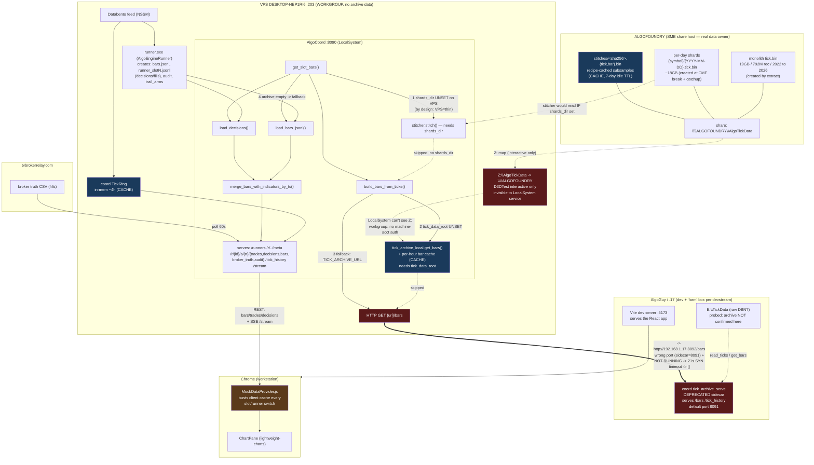

# Live-chart bars pipeline — architecture diagnosis (2026-05-15)

**Symptom reported:** live charts take a long time to load, every time, like there's no caching.

**Verdict:** not a caching problem. Every `/bars` request burns a fixed **~21s on a dead
HTTP dependency, returns 0 archive bars**, then silently falls back to ~747
`bars.jsonl` live bars. The chart has *never* shown real archive history on the VPS.
There is also no caching at any layer, which compounds it.

Proof, straight from coord's own timing log, identical on every request:

```
[bars-timing] xovd-prod-3way/s1 decisions=0.13s(2602) archive=21.05s(0) live=0.00s(747) merge=0.00s total=21.18s
```

---

## Architecture as it exists now

Red = broken/dead path · dashed = unused-by-design or absent · blue = a cache.



---

## The dysfunction, distilled

| # | Problem | Consequence |
|---|---------|-------------|
| 1 | VPS coord has `shards_dir` + `tick_data_root` both unset (by devstream design: "VPS = thin") | Both fast in-proc bar paths skipped |
| 2 | Falls back to HTTP `/bars` — an endpoint **only the DEPRECATED sidecar** serves (merged coord dropped it) | The documented fallback targets an orphaned API |
| 3 | `TICK_ARCHIVE_URL` = `.17:8092`; sidecar default is `8091`; nothing running either way | 21s SYN timeout, 0 archive bars, every request |
| 4 | Real data lives on **ALGOFOUNDRY**, not .17; reachable from VPS only via `Z:` which LocalSystem can't see (workgroup, no machine-acct auth) | No clean in-proc path to the data from the service principal |
| 5 | No server-side response cache; client busts its cache every slot switch | Even the wasted work is re-paid on every navigation |
| 6 | Archive failure silently degrades to `bars.jsonl` (~747 live bars) | Chart has *never* shown real history; failure is invisible (violates prime directive) |

**Core architectural lie:** the "farm box" in the design (.17) is not where the data
actually is (ALGOFOUNDRY), and the VPS-thin model assumes an HTTP archive server that
no longer exists after the sidecar was merged into coord. Every other symptom is
downstream of that mismatch.

---

## Probed facts (so this is verifiable, not assumed)

- VPS `coord_config.toml` has no `shards_dir` / `tick_data_root` / `data_windows_dir`.
- VPS NSSM env: `TICK_ARCHIVE_URL=http://192.168.1.17:8092`; `AlgoCoord` runs as `LocalSystem`.
- `.17:8091` and `.17:8092` — nothing listening.
- VPS `Z:` → `\\ALGOFOUNDRY\AlgoTickData`, persistent mapping for D3DTest's SID only, `Unavailable` in non-interactive sessions.
- VPS is `WORKGROUP` (`DESKTOP-HEP1RI6`, `PartOfDomain=False`) → no machine-account SMB identity to grant.
- Merged coord exposes `/tick_history`, `/tick_status`, `/r/{id}/s/{n}/bars`, `/api/playground/.../bars` — **no top-level `/bars`**.
- `coord/tick_archive_serve.py` is the only thing that serves `/bars`; header says `DEPRECATED`, default port 8091.
- devstream 2026-05-14: VPS coord intentionally leaves `tick_data_root` unset (VPS=thin, farm owns data); an **open, unresolved** proposal moves `E:/AlgoData/coord/` → `E:/MarketData/...` and renames `shards_dir` → `market_shards_dir`.

---

## Status of fixes

| Task | State |
|---|---|
| Coord fast-fail + circuit-breaker on the archive path (2s connect probe + 60s breaker) | **done in `coord/jsonl.py`**, not yet deployed — kills the 21s hang regardless of topology |
| Coord: surface archive-unavailable state to UI | pending |
| Coord: short-TTL response cache for assembled bars | pending |
| UI: stop cache-busting every slot switch + surface degraded state | pending |
| Data path (real archive history on VPS chart) | **blocked on topology decision** — premise of current model is broken; needs target-architecture pick + engine-claude coordination on the in-flight layout rename |

Next step: choose a coherent **target** architecture rather than keep patching a model
whose premise (farm=.17, HTTP archive server exists) is false.
